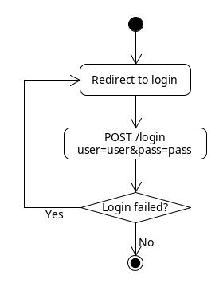
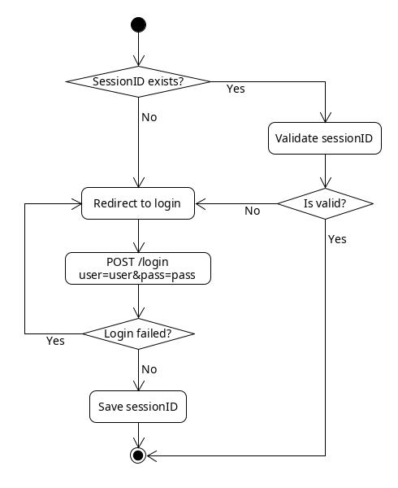
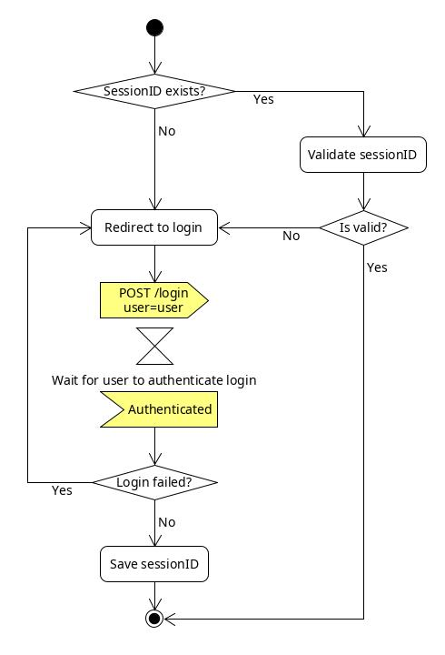
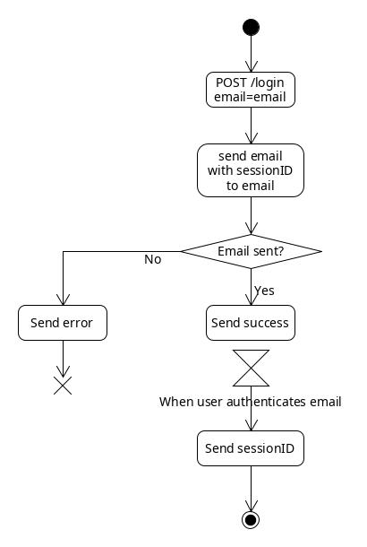
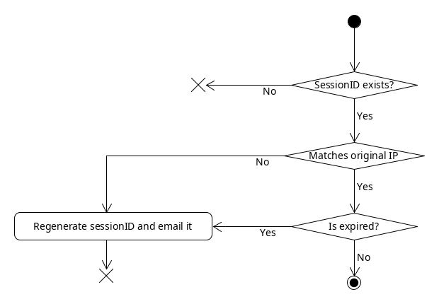

Passwordless Authentication
===========================

Nowadays most of the user authentication methods rely on a username and a password in order to authenticate the user.

This forces the user to remember the password and forces the service to keep a strict secure control over the passwords.

Standard Authentication
-----------------------

Based on my sole experience, the authentication flow of an average app is like this:

However, this is just the authentication itself, the user would need to authenticate for each request.
To solve this, a session ID generated by the server is saved and checked if it exists:

Going Passwordless
------------------

Taking the password away from the equation, simplifies the costs of the server and enhances user experience. However, the need to authenticate the user is still there, so there must be an alternative way for password.

Taking the password away wouldn't suppose any fundamental change to the already established flow:

Using the Session ID as an authentication string, the password becomes useless. However, it means that there must be an external way to authenticate the user, for example, with an email:

This way, not only we get rid of the password, but we also confirm the email direction instantly.

It also removes the differences between login and register, the same form/page can perform both actions.

Enhancements
------------

Having to send an email every time the user wants to authenticate is counterproductive.

In order to make the authentication smoother the sessionID is saved in the cache of the browser and then validated.

The validation consist of checking if the sessionID exists and its origin:

